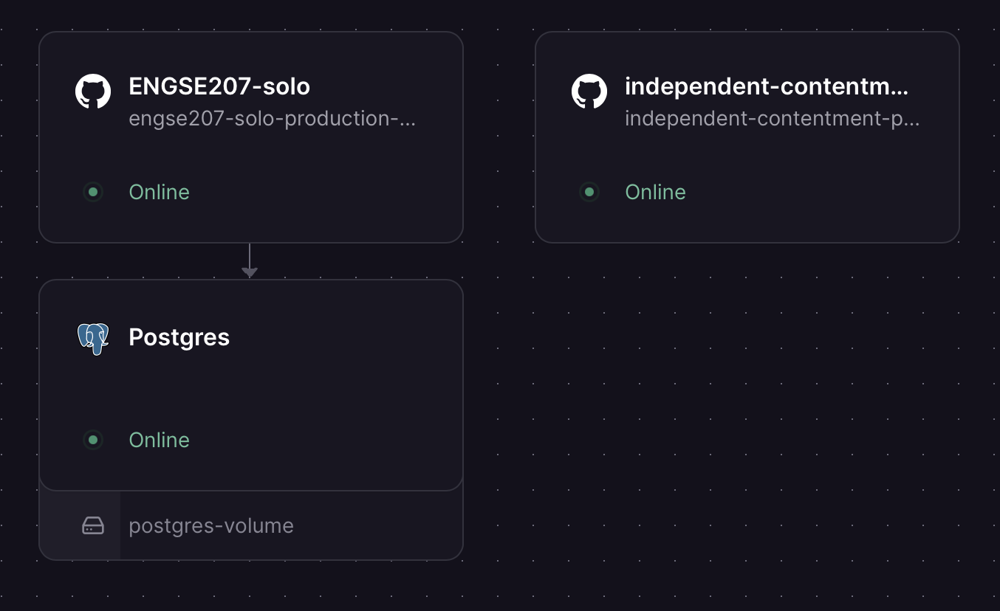
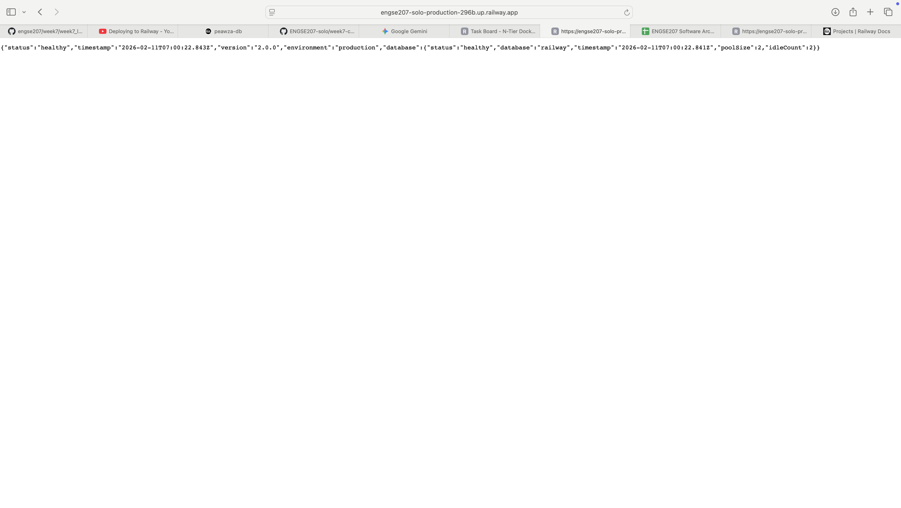
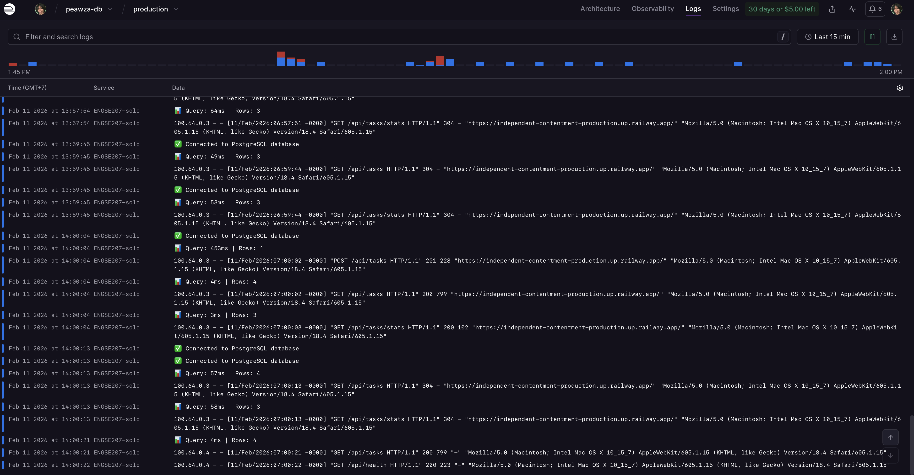
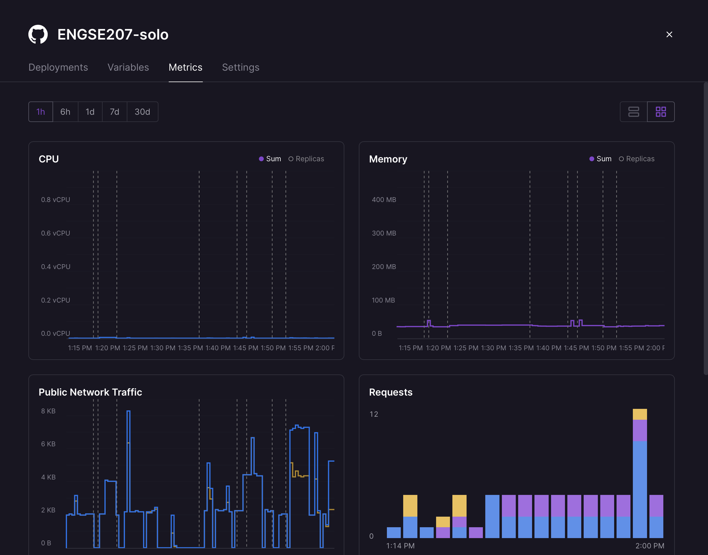

# Cloud Deployment Analysis
## ENGSE207 - Week 7 Lab

**ชื่อ-นามสกุล:** ปวริศ คูณศรี
**รหัสนักศึกษา:** 67543210037-7

### 1.1 URLs ของระบบที่ Deploy

| Service | URL |
|---------|-----|
| Frontend | https://independent-contentment-production.up.railway.app|
| Backend API | https://engse207-solo-production-296b.up.railway.app |
| Database | (Internal - ไม่มี public URL) |

### 1.2 Screenshot หลักฐาน (5 รูป)

1. [ ] Railway Dashboard แสดง 3 Services

2. [ ] Frontend ทำงานบน Browser

3. [ ] API Health check response

4. [ ] Logs แสดง requests

5. [ ] Metrics แสดง CPU/Memory

### 2.1 ความแตกต่างที่สังเกตเห็น (10 คะแนน)

| ด้าน | Docker (Week 6) | Railway (Week 7) |
|------|-----------------|------------------|
| เวลา Deploy | ขั้นตอนซับซ้อน | ง่าย มี GUI .SH |
| การตั้งค่า Network | ต้องใช้ cli ทั้งหมดยุ่งยาก | ง่ายมาก |
| การจัดการ ENV | ต้องจัดการที่ตัวไฟล์ | มีหน้าต่างจัดการให้ และบาง Variable มีเตรียมให้แล้ว |
| การดู Logs | ต้องพิม command ทุกครั้ง ดูยาก | สามารถดูในเว็บได้เลย |
| การ Scale | ขึ้นอยู่กับสเปคเครื่องที่ใช้ | Scale ง่าย ขึ้นอยู่กับเงิน |

### 2.2 ข้อดี/ข้อเสีย ของแต่ละแบบ (5 คะแนน)

**Docker Local:**
- ข้อดี: ปลอดภัย ใช้ทรัพยากรตัวเอง
- ข้อเสีย: scale ยาก

**Railway Cloud:**
- ข้อดี: scale ง่าย ปลอดภัย ใช้ได้ 24/7
- ข้อเสีย: เสียเงิน
### 3.1 Railway เป็น Service Model แบบไหน?

[ ] IaaS   [x] PaaS   [ ] SaaS

เพราะ: Railway จัดเตรียม platform ให้โดยที่ไม่ต้องจัดการ OS

### 3.2 ถ้าใช้ IaaS (เช่น AWS EC2) ต้องทำอะไรเพิ่มอีก? (ยกตัวอย่าง 4 ข้อ)

1. OS Setup & Security Patching
2. Web Server Configuration
3. Runtime Installation
4. Network & Firewall
### 4.1 Factors ที่เห็นจาก Lab (10 คะแนน)

เลือก 5 Factors และอธิบายว่าเห็นจากไหนใน Railway:

| Factor | เห็นจากไหน? | ทำไมสำคัญ? |
|--------|------------|-----------|
| Factor 3: Config | Variables tab | Railway	แยกข้อมูลสำคัญ (เช่น DATABASE_URL) ออกจากโค้ด เพื่อความปลอดภัยและเปลี่ยนค่าตาม Environment ได้ง่าย |
| Factor 1: Codebase | GitHub Repository | มี Codebase ชุดเดียวที่ใช้ Deploy ไปยังหลายสภาพแวดล้อมได้ และมีการควบคุมเวอร์ชัน (Version Control) |
| Factor 7: Port binding | process.env.PORT ในโค้ด | ช่วยให้ Application สามารถรันบนพอร์ตที่ Cloud (Railway) กำหนดมาให้ได้โดยไม่เกิดข้อผิดพลาด |
| Factor 11: Logs | Logs tab ใน Railway Dashboard | ช่วยในการตรวจสอบสถานะ (Health Check) และวินิจฉัยปัญหา (Debug) ที่เกิดขึ้นบน Server จริงได้ทันที |
| Factor 10: Dev/Prod Parity | การใช้โครงสร้างเดียวกันทั้ง Local และ Cloud | ลดปัญหา "รันได้ในเครื่องฉัน แต่รันบน Cloud ไม่ได้" โดยใช้สภาพแวดล้อมที่ใกล้เคียงกันที่สุด |

### 4.2 ถ้าไม่ทำตาม 12-Factor จะมีปัญหาอะไร? (5 คะแนน)

ยกตัวอย่าง 2 ปัญหา:

**ปัญหา 1:** ถ้าไม่ทำตาม Factor 3 (Config)
- สิ่งที่จะเกิด: ข้อมูลสำคัญ เช่น รหัสผ่านฐานข้อมูล จะหลุดไปพร้อมกับ source code ใน GitHub ทำให้เกิดช่องโหว่ด้านความปลอดภัยอย่างร้ายแรง

**ปัญหา 2:** ถ้าไม่ทำตาม Factor 7 (Port Binding)
- สิ่งที่จะเกิด: แอปพลิเคชันจะล้มเหลว (Crash) เมื่อขึ้น Cloud เพราะพอร์ตที่ Fix ไว้ (เช่น 3000) อาจถูกใช้งานอยู่ หรือระบบ Cloud ไม่อนุญาตให้ใช้พอร์ตนั้นโดยตรง
### 5.1 สิ่งที่เรียนรู้จาก Lab นี้

1. เข้าใจกระบวนการ Deploy แอปพลิเคชันแบบ Full-stack (Node.js + PostgreSQL) ขึ้นระบบ Cloud จริง
2. รู้วิธีการจัดการ Environment Variables เพื่อแยกการตั้งค่าฐานข้อมูลออกจากตัวโค้ด
3. เรียนรู้การจัดการปัญหา CORS และ Port Binding เพื่อให้ Frontend และ Backend สื่อสารกันได้บน Production

### 5.2 ความท้าทาย/ปัญหาที่พบ และวิธีแก้ไข

ปัญหา: แอปพลิเคชัน Build ไม่ผ่านเพราะหา npm ไม่เจอ และ Frontend ยิง API ไม่ได้เนื่องจากพิมพ์ URL ผิด (https) 
วิธีแก้: กำหนด Root Directory ใน Railway ให้ชี้ไปที่ /week7-cloud/api ให้ถูกต้อง, แก้ไขตัวสะกด URL ใน app.js 

### 5.3 จะเลือกใช้ Docker หรือ Cloud เมื่อไหร่?

- ใช้ Docker เมื่อ: ต้องการควบคุมสภาพแวดล้อมให้เหมือนกันเป๊ะระหว่างเครื่อง Developer และ Production หรือต้องการรันแอปบน Server ของตัวเอง (On-premise)
- ใช้ Cloud (PaaS) เมื่อ: ต้องการความรวดเร็วในการ Deploy, ไม่ต้องการเสียเวลาดูแล Server เอง และต้องการระบบที่ Scale ง่ายรองรับผู้ใช้งานจำนวนมาก